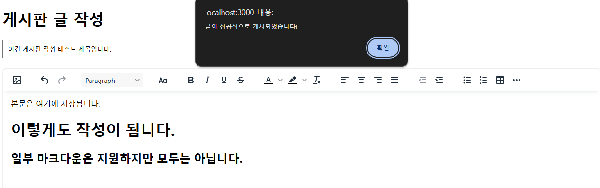
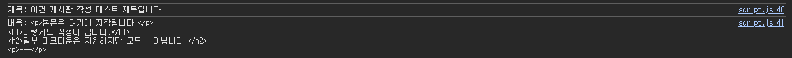

# TinyMCE Editor를 이용한 Rich Text Editor 게시판 구현하기
### 테스트

- 터미널(bash, cmd, powershell) 실행
- `npm install express`
- `node rich-text.js`
- 웹 브라우저를 이용해 http://localhost:3000 에 접속
- 게시판의 글 작성 후 게시 버튼으로 서버에 전송

### 결과

- 현재는 게시 버튼 누르면 콘솔 출력
