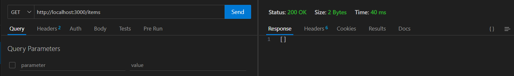
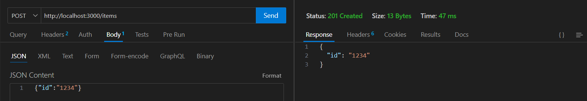
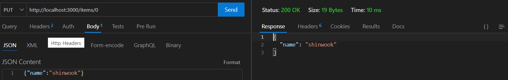
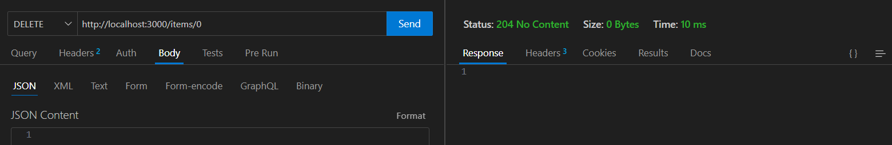

# 2. RESTful API 개발

### Lab 설명

Express.js를 사용하여 기본적인 CRUD 기능을 제공하는 RESTful API를 구축합니다.

### 목표

- Express.js 설치 및 기본 사용법 익히기
- RESTful API의 기본 구조 이해

### 테스트

- 터미널(bash, cmd, powershell) 실행
- `node rest-api.js`
- Postman이나 Thunder Client(vscode), HTTP Client(InteliJ) 등을 이용해 HTTP 요청 보내기

  - GET `http://localhost:3000/items`
  - POST `http://localhost:3000/items`
    - body (json): { "id": "1234" }
  - PUT `http://localhost:3000/items/<index>`
    - body (json): { "id": "4321" }
  - DELETE `http://localhost:3000/items/<index>`
### 결과
  
  
  
  