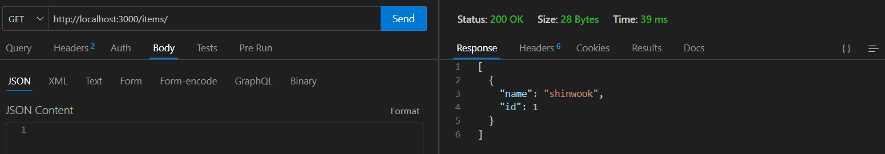
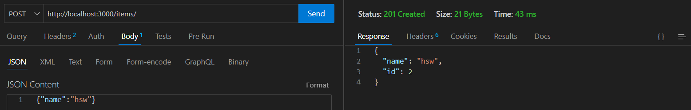
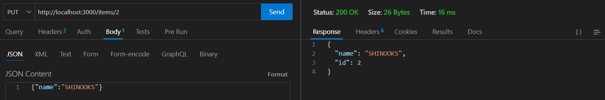
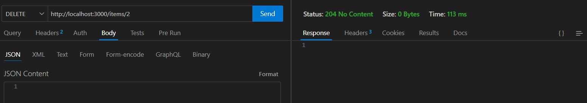

# 3. 파일 시스템 모듈 사용

### Lab 설명

Node.js의 `fs` 모듈을 사용하여 파일 읽기, 쓰기, 삭제 등의 작업을 수행합니다.

### 목표

- Node.js의 파일 시스템 모듈 사용법 익히기
- 비동기 파일 처리 이해
- 파일을 이용한 영속성 유지하기

### 테스트 1
자바스크립트로 로컬에 파일 생성하고, 출력하고, 삭제하기 (Simple CRD)
- 터미널(bash, cmd, powershell) 실행
- `npm install fs`
- `node file-system.js`

### 결과 1
- 파일이 생긴다 -> Content가 출력된다. -> 삭제된다. (이 과정 중에 생성된 파일은 안보임)
```
File written successfully
File content: Hello, Node.js!
File deleted
```

### 테스트 2
Rest API와 파일 시스템을 이용해 데이터를 보존하고 관리하기 (Simple CRUD)
- `node Rest-API & File System.js`
- Postman이나 Thunder Client(vscode), HTTP Client(InteliJ) 등을 이용해 HTTP 요청 보내기

  - GET `http://localhost:3000/items`
  - POST `http://localhost:3000/items`
    - body (json): { "name": "HSW" }
  - PUT `http://localhost:3000/items/1`
    - body (json): { "name": "shinwook" }
  - DELETE `http://localhost:3000/items/1`

### 결과
  
  
  
  