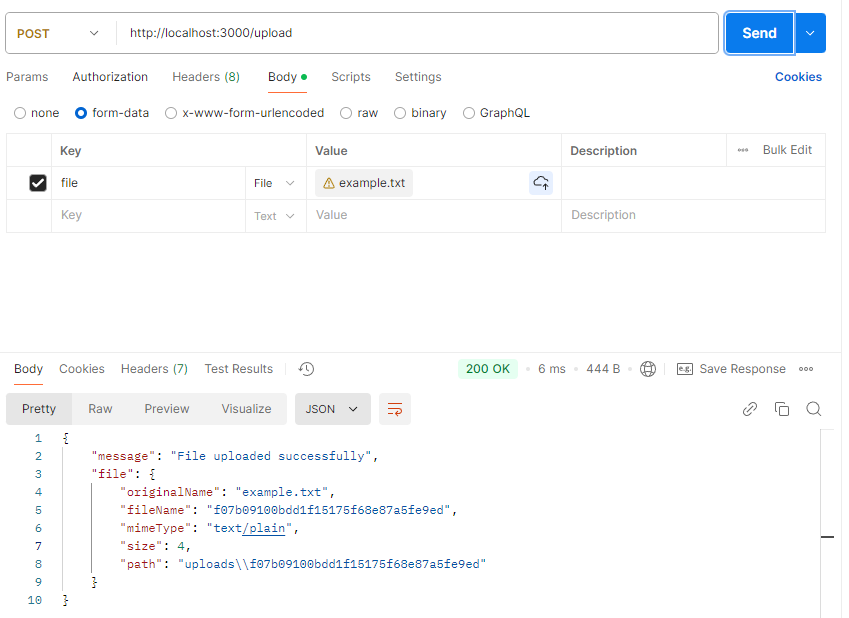

# 8. 파일 업로드 기능
### 테스트
- `npm install express multer`
- `node file-upload.js`
- Postman이나 Thunder Client을 이용해 파일 업로드 테스트
- [POST] http://localhost:3000/upload 요청 보내기 (Thunder Client는 File 전송이 유료 버전)
    - **Body** 탭에서 `form-data`를 선택 후 `Key`에 `file`, `Value`에 파일을 추가.

### 결과
- 로그 확인
```bash
Uploaded file info: {
  fieldname: 'file',
  originalname: 'example.txt',
  encoding: '7bit',
  mimetype: 'text/plain',
  destination: 'uploads/',
  filename: 'ef70b6a4d28932f1cd4c12699fbc3c4f',
  path: 'uploads\\ef70b6a4d28932f1cd4c12699fbc3c4f',
  size: 4
}
```
- 업로드된 파일 확인
- 업로드된 파일은 서버의 `uploads/` 디렉토리에 저장됩니다.
- 파일 이름은 Multer가 자동으로 생성한 고유한 이름으로 저장됩니다.
    